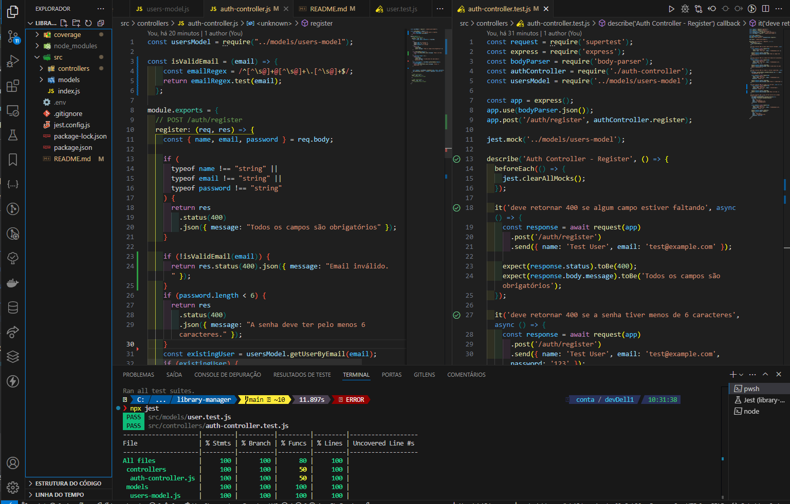
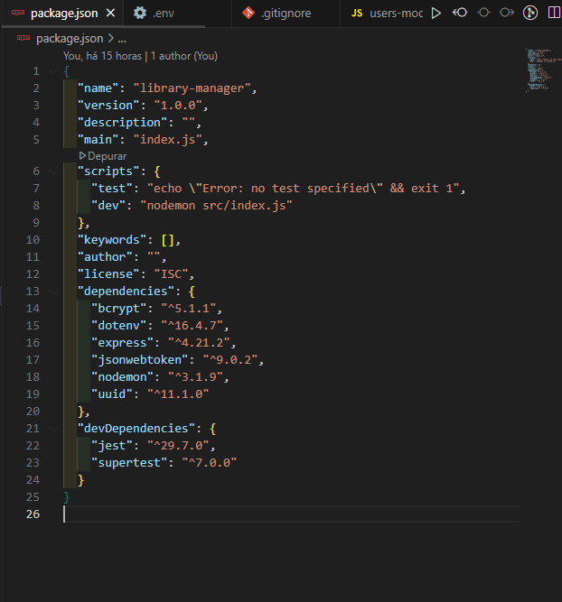

# 📚 Library Manager

## Description
The **Library Manager** is a practical study project focused on **Backend** development, aiming to manage users, books, and loans in a web application. The project was developed to enhance skills in Node.js, Express, JWT (JSON Web Tokens) authentication, and automated testing with Jest and Supertest. It serves as a foundation to understand concepts such as routes, middlewares, models, and integration of external libraries.

---
<!-- 
## 🔗 Online Link
The project is available on GitHub:  
[**https://github.com/mdanieldantas/library-manager.git**](https://github.com/mdanieldantas/library-manager.git) -->

---

## 🖼️ Project Images



---

## 🚀 Features
- **🔐 User Authentication**: Registration and login with JWT.
- **🔒 Route Protection**: Middleware to ensure only authenticated users can access specific routes.
- **📚 Book Management**: Create, read, update, and delete books.
- **📖 Loan Management**: Borrow and return books by authenticated users.
- **🧪 Automated Testing**: Integration and unit tests with Jest and Supertest.
- **⚙️ Environment Variables**: Use of `.env` for sensitive configurations.

---

## 🛠️ Technologies Used
- **Node.js**: JavaScript runtime environment.
- **Express**: Framework for building APIs.
- **JWT (JSON Web Tokens)**: Secure authentication.
- **Bcrypt**: Password encryption.
- **UUID**: Unique ID generation.
- **Dotenv**: Environment variable management.
- **Nodemon**: Automatic server restart during development.
- **Jest**: Testing framework.
- **Supertest**: API integration testing.

---

## 🏃‍♂️ How to Run the Project

### Prerequisites
- Node.js installed (version 16 or higher).
- NPM or Yarn for dependency management.

### Steps to Run
1. **Clone the repository**:
   ```bash
   git clone https://github.com/mdanieldantas/library-manager.git
   cd library-manager
   ```

2. **Install dependencies**:
   ```bash
   npm install
   ```

3. **Configure environment variables**:
   Create a `.env` file in the project root and add the following variables:
   ```env
   PORT=3000
   JWT_KEY=a-very-secure-secret-key
   ```

4. **Run the project**:
   ```bash
   npm run dev
   ```

5. **Run tests**:
   ```bash
   npm test
   ```

---

## 📂 Project Structure
```
library-manager/
├── coverage/
├── front-test/
├── search-form-author.html
├── node_modules/
├── src/
│   ├── assets/
│   ├── controllers/
│   │   ├── auth-controller.js
│   │   ├── auth-controller.test.js
│   │   ├── books-controller.js
│   │   └── loans-controller.js
│   ├── errors/
│   │   └── HttpError.js
│   ├── middlewares/
│   │   ├── auth-middleware.js
│   │   └── error-middleware.js
│   ├── models/
│   │   ├── books-model.js
│   │   ├── books-model.test.js
│   │   ├── loans-model.js
│   │   ├── user.test.js
│   │   └── users-model.js
│   ├── routes/
│   │   ├── api.js
│   │   ├── auth.js
│   │   └── index.js
│   └── index.js
├── .env
├── .gitignore
├── jest.config.js
├── package-lock.json
├── package.json
└── README.md
```

---

## 📚 Learnings
- **JWT Authentication**: How to implement a secure authentication system.
- **Middlewares**: How to create and use middlewares to protect routes.
- **Book and Loan Management**: How to implement CRUD for books and loans.
- **Automated Testing**: How to write integration and unit tests with Jest and Supertest.
- **Environment Variables**: How to manage sensitive configurations with `.env`.
- **Dependency Management**: How to structure a Node.js project with Express.

---

## 🤝 Contributions
Contributions are welcome! Follow the steps below:
1. Fork the project.
2. Create a branch for your feature (`git checkout -b feature/new-feature`).
3. Commit your changes (`git commit -m 'Add new feature'`).
4. Push to the branch (`git push origin feature/new-feature`).
5. Open a Pull Request.

---

## 📜 License
This project is licensed under the **ISC License**. See the [LICENSE](LICENSE) file for details.

---

## 📞 Contact

**M Daniel Dantas**

- **GitHub:** [mdanieldantas](https://github.com/mdanieldantas)
- **LinkedIn:** [mdanieldantas](https://www.linkedin.com/in/mdanieldantas)
- **Portfolio:** [Daniel Dantas Portfolio](https://danieldantasdev.vercel.app)
- **Email:** [contatomarcosdgomes@gmail.com](mailto:contatomarcosdgomes@gmail.com)
- **Resume:** [Download Resume](https://docs.google.com/document/d/1_FpPYPXiifH1B3BDWnJuNk05DQfddCOBqFxyT6Citg4/edit?usp=sharing)

---
